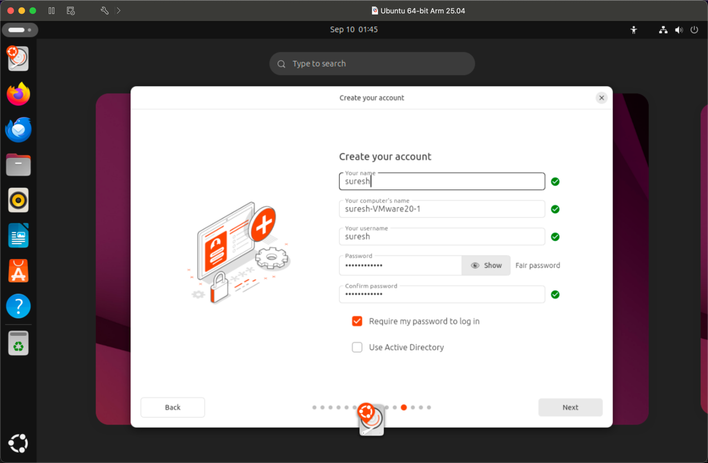

# Ubuntu 25.04 Virtual Machine Installation

#### Learning Objectives

By completing this tutorial, you will be able to:

- Set up a virtual machine environment using VMware
- Install Ubuntu 25.04 operating system in a virtualized environment
- Configure basic Ubuntu settings including user accounts and system preferences
- Navigate the Ubuntu desktop environment
- Troubleshoot common installation issues

#### Introduction

This guide provides step-by-step instructions for installing Ubuntu 25.04 in a virtual machine. Virtual machines allow
you to run multiple operating systems on a single computer, making them ideal for learning, testing, and development
purposes. Ubuntu is a popular Linux distribution known for its user-friendly interface and robust community support.

Before beginning the installation process, you need to download the appropriate software for your operating system.
Windows users should obtain the:

* ubuntu-24.04.3-desktop-amd64 ISO file
* VMware-workstation-full-17.6.4-24832109 virtualization software

While macOS users need the:

* ubuntu-25.04-desktop-arm64 ISO file
* VMware-Fusion-13.6.4-24832108_universal software

Both Ubuntu ISO files can be downloaded from [OneDrive software-downloads folder](https://mystjohns-my.sharepoint.com/:f:/g/personal/sigeras_stjohns_edu/EgvWb4dZKTRPhs_pLZiQpPEBgsJ-twMHyrGdpPT-6kjx9Q?e=Z2sPH8). Additionally, ensure your system has at
least 4GB of available RAM for the virtual machine, a minimum of 25GB free disk space for the VM, and hardware
virtualization support enabled in your BIOS/UEFI settings.

#### Step 1: Virtual Machine Setup

1. Open your virtualization software
2. Click "New..." to create a new virtual machine
3. Select "Create a custom virtual machine"
4. Browse and select your Ubuntu ISO file
5. Name your VM (example: "Ubuntu 64-bit Arm 25.04")
6. Choose save location in your Virtual Machines folder
7. Click "Save"

#### Step 2: Boot and Initial Configuration

1. Start the virtual machine
2. When the GNU GRUB bootloader appears, select "Try or Install Ubuntu"
   
3. Choose your language (English is default)
   
4. Select your keyboard layout (English US is most common)
5. Configure accessibility options if needed
6. Select "Install Ubuntu" for permanent installation
   

#### Step 3: Installation Configuration

1. If prompted with installer updates, click "Skip" to continue
2. Choose "Use wired connection" and click "next"
3. Select "Default selection" for software packages
   
4. Choose "Interactive installation" method
   
5. Select "Default selection" for "What apps would you like to install to start with?"
   - This includes just the essentials: web browser and basic utilities
6. Configure optimization settings for proprietary software
7. Set up your timezone and location
8. Select "Erase disk and install Ubuntu"
9. Choose "No encryption" for simpler setup
   
10. Verify partition setup and configuration
    
11. Click "Install" to begin the installation process

#### Step 4: User Account Creation

1. Enter your full name
2. Your computer's name will auto-generate
   
3. Create a username
4. Set a secure password and confirm it
5. Check "Require my password to log in"
6. Proceed with installation

#### Step 5: Installation and First Boot

1. Installation will begin automatically and take 15-30 minutes
2. Do not interrupt the process
3. System will restart automatically after completion
4. Log in with your created account
5. Complete any final setup prompts
   
   
   
   

#### Summary

You have successfully installed Ubuntu 25.04 in a virtual machine environment. Your system now includes a fully
functional Linux desktop with essential applications and utilities. The virtual machine provides a safe environment for
learning Linux commands, testing software, and exploring open-source development tools without affecting your host
operating system.

#### Additional Resources

- System Updates: Run `sudo apt update && sudo apt upgrade` to keep your system current
- Ubuntu Documentation: [https://help.ubuntu.com/](https://help.ubuntu.com/)